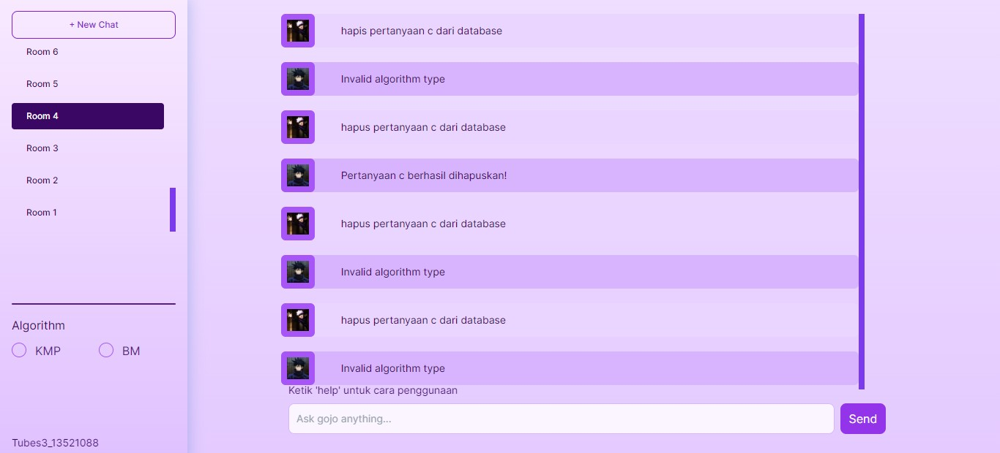

# Simple ChatGPT App with String Matching Algorithm Knuth Morris Pratt, Boyer Moore and Regular Expression
Tugas ini dibuat untuk memenuhi tugas IF2211 Strategi Algoritma. Web app ini dapat menjawab pertanyaan anda, mulai dari operasi matematika, tanggal, serta pertanyaan lain! Selain itu anda dapat menambahkan dan menghapus pertanyaan dari basis data.

# Description

### Selamat datang di ChatGPTdupe. Berikut panduan penggunaan fitur yang ada pada aplikasi ini.
#### 1. Menanyakan pertanyaan
Anda dapat menanyakan pertanyaan pada ChatGPTdupe. Contoh:
Apa matkul terseru?

#### 2. Menambahkan pertanyaan ke databse
Untuk menambahkan pertanyaan ke database, berikut adalah beberapa masukan yang diterima:
Tambahkan pertanyaan XXX dengan jawaban YYY ke dalam database
Simpan query XXX dengan jawaban YYY ke database
Masukkan pertanyaan XXX dengan respon YYY ke dalam basis data

#### 3. Menghapus pertanyaan dari database
Untuk menghapus pertanyaan ke database, berikut adalah beberapa masukan yang diterima:
Hapus pertanyaan XXX dari database
Hilangkan informasi query XXX dari database
Hapus data pertanyaan XXX dari basis data

#### 4. Kalkulator
Anda dapat menggunakan fitur ini untuk melakukan perhitungan matematis yang melibatkan
operator +, -, *, /, ^, (, dan ). Contoh:
(3+5-(6/2))^3

#### 5. Menanyakan hari pada suatu tanggal
Untuk menanyakan hari pada suatu tanggal, Anda dapat menggunakan format berikut
Hari apa 03/05/1921?
28/05/2006?
31/01/1872

# Deployment
[Deployment](tubes3-13521088-sepia.vercel.app/)

# Author
| NIM  | Nama |
| ------------- | ------------- |
| 13521088 | Puti Nabilla Aidira |
| 13521132 | Dhanika Novlisariyanti |
| 13521170 | Haziq Abiyyu Mahdy |
